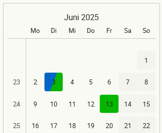
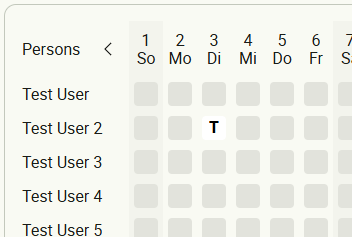

# FsCalendarModule Documentation

The `FsCalendarModule` provides advanced, flexible calendar components for Angular Material applications. It includes both calendar panels and table views, supporting custom data, range selection, and Material 3 theming.

---

## Features

- **Calendar Panels** for monthly or annual views
- **Calendar Table** for tabular, multi-entry calendar data
- **Range and single date selection** support
- **Custom day rendering** (colors, tooltips, badges, etc.)
- **Material 3 theming** and accessibility
- **Highly configurable** via inputs

---

## Module Import

```ts
import { FsCalendarModule } from '@fullstack-devops/ngx-mat-components';
```

---

## Main Components & Directives

- [`FsCalendarPanelsComponent`](../projects/ngx-mat-components/src/fs-calendar/calendar-panels/calendar-panels.component.ts)
- [`FsCalendarTableComponent`](../projects/ngx-mat-components/src/fs-calendar/calendar-table/fs-calendar-table.component.ts)
- [`FsCalendarTableNameDirective`](../projects/ngx-mat-components/src/fs-calendar/directives/fs-calendar-table-name.directive.ts)

---

## Usage Examples

### Calendar Panels

```html
<fs-calendar-panels
  [dataSource]="calendarPanelsData"
  [year]="year"
  [month]="month"
  [monthsBefore]="monthsBefore"
  [monthsAfter]="monthsAfter"
  [placeholderDay]="placeholder"
  (selection)="onSelection($event)">
</fs-calendar-panels>
```

### Calendar Table

```html
<fs-calendar-table [(month)]="month" [(year)]="year" [dataSource]="calendarTableData">
  <fs-calendar-table-name>Persons</fs-calendar-table-name>
</fs-calendar-table>
```

---

## Configuration

### Calendar Panels Data

[`CalendarPanels`](../projects/ngx-mat-components/src/fs-calendar/calendar.models.ts):

```ts
export interface CalendarPanels<T = void> {
  config: CalendarPanelsConfig;
  data: CalendarExtendedDay<T>[];
}
```

#### Example Config

[`CalendarPanelsConfig`](../projects/ngx-mat-components/src/fs-calendar/calendar.models.ts):

```ts
export interface CalendarPanelsConfig {
  renderMode: 'monthly' | 'annual';
  selectMode: 'click' | 'range';
  calendarWeek: boolean;
  displayYear?: boolean;
  switches?: boolean;
  bluredDays?: boolean;
  markWeekend?: boolean;
  firstDayOfWeekMonday?: boolean;
  panelWidth?: string;
}
```

#### Example Data

[`CalendarExtendedDay`](../projects/ngx-mat-components/src/fs-calendar/calendar.models.ts):

```ts
export interface CalendarExtendedDay<T = void> {
  date: Date;
  char?: string;
  colors?: {
    backgroundColor: string;
    color?: string;
  };
  toolTip?: string;
  badge?: {
    badgeMode: 'int' | 'icon';
    badgeInt?: number;
    badgeIcon?: string;
  };
  _meta?: CalendarExtendedDayMeta;
  customData?: T;
}
```

### Calendar Table Data

[`CalendarTableEntry`](../projects/ngx-mat-components/src/fs-calendar/calendar.models.ts):

```ts
export interface CalendarTableEntry {
  name: string;
  data: CalendarExtendedDay[];
}
```

---

## Selection Events

- The panels emit a `(selection)` event with a [`CalendarEvent`](../projects/ngx-mat-components/src/fs-calendar/calendar.models.ts):
  - Range selection: `{ type: 'range', start, end, affectedDays }`
  - Single date: `{ type: 'click', date }`

---

## Theming & Styling

- The module supports Material 3 theming.
- SCSS mixin: `fs-calendar-theme` ([styles/fs-calendar/_theming.scss](../projects/ngx-mat-components/styles/fs-calendar/_theming.scss))
- To use the theme in your styles:
  ```scss
  @use '@fullstack-devops/ngx-mat-components' as fsc;
  @include fsc.core();
  ```

---

## API Reference

- [`FsCalendarPanelsComponent`](../projects/ngx-mat-components/src/fs-calendar/calendar-panels/calendar-panels.component.ts)
- [`FsCalendarTableComponent`](../projects/ngx-mat-components/src/fs-calendar/calendar-table/fs-calendar-table.component.ts)
- [`FsCalendarTableNameDirective`](../projects/ngx-mat-components/src/fs-calendar/directives/fs-calendar-table-name.directive.ts)
- [`CalendarPanels`](../projects/ngx-mat-components/src/fs-calendar/calendar.models.ts)
- [`CalendarPanelsConfig`](../projects/ngx-mat-components/src/fs-calendar/calendar.models.ts)
- [`CalendarExtendedDay`](../projects/ngx-mat-components/src/fs-calendar/calendar.models.ts)
- [`CalendarTableEntry`](../projects/ngx-mat-components/src/fs-calendar/calendar.models.ts)
- [`CalendarEvent`](../projects/ngx-mat-components/src/fs-calendar/calendar.models.ts)
- [`FsCalendarService`](../projects/ngx-mat-components/src/fs-calendar/services/fs-calendar.service.ts)

---

## Example Screenshots




---

## See Also

- [Live Demo](https://fullstack-devops.github.io/ngx-mat-components)
- Workspace Examples:
  - [showcase-calendar-panels](https://github.com/fullstack-devops/ngx-mat-components/tree/main/projects/lib-workspace/src/app/content/showcase-calendar-panels)
  - [showcase-calendar-table](https://github.com/fullstack-devops/ngx-mat-components/tree/main/projects/lib-workspace/src/app/content/showcase-calendar-table)