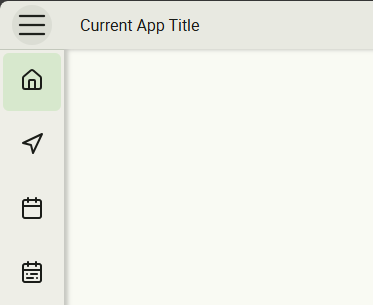

# FsNavFrameModule Documentation

The `FsNavFrameModule` provides a flexible, modern navigation frame for Angular Material applications. It includes a responsive sidebar, toolbar, and user profile area, supporting content projection and theming.

---

## Features

- **Responsive sidebar navigation** with customizable items and icons
- **Toolbar** with start, center, and end content slots
- **User profile section** with name, subname, actions, and profile picture
- **Configurable sizing** for toolbar and sidebar
- **Content projection** for full layout flexibility
- **Material 3 theming** support

---

## Module Import

```ts
import { FsNavFrameModule } from '@fullstack-devops/ngx-mat-components';
```

---

## Main Components & Directives

- [`FsNavFrameComponent`](../projects/ngx-mat-components/src/fs-nav-frame/fs-nav-frame.component.ts)
- [`FsNavFrameToolbarComponent`](../projects/ngx-mat-components/src/fs-nav-frame/nav-frame-toolbar/fs-nav-frame-toolbar.component.ts)
- [`FsNavFrameSidebar`](../projects/ngx-mat-components/src/fs-nav-frame/components/fs-nav-frame-sidebar.ts)
- [`FsNavFrameSidebarItemComponent`](../projects/ngx-mat-components/src/fs-nav-frame/components/fs-nav-frame-sidebar-item/fs-nav-frame-sidebar-item.component.ts)
- [`FsNavUserProfileComponent`](../projects/ngx-mat-components/src/fs-nav-frame/fs-nav-user-profile/fs-nav-user-profile.component.ts)
- [`FsNavFrameContentDirective`](../projects/ngx-mat-components/src/fs-nav-frame/directives/fs-nav-frame-content.directive.ts)
- Toolbar slot directives:  
  - [`FsNavFrameToolbarStartDirective`](../projects/ngx-mat-components/src/fs-nav-frame/nav-frame-toolbar/directives/fs-nav-frame-toolbar-start.directive.ts)  
  - [`FsNavFrameToolbarCenterDirective`](../projects/ngx-mat-components/src/fs-nav-frame/nav-frame-toolbar/directives/fs-nav-frame-toolbar-center.directive.ts)  
  - [`FsNavFrameToolbarEndDirective`](../projects/ngx-mat-components/src/fs-nav-frame/nav-frame-toolbar/directives/fs-nav-frame-toolbar-end.directive.ts)
- User profile slot directives:  
  - [`FsNavUserProfileNameDirective`](../projects/ngx-mat-components/src/fs-nav-frame/fs-nav-user-profile/directives/fs-nav-user-profile-name.directive.ts)  
  - [`FsNavUserProfileSubNameDirective`](../projects/ngx-mat-components/src/fs-nav-frame/fs-nav-user-profile/directives/fs-nav-user-profile-subname.directive.ts)  
  - [`FsNavUserProfileActionsDirective`](../projects/ngx-mat-components/src/fs-nav-frame/fs-nav-user-profile/directives/fs-nav-user-profile-actions.directive.ts)

---

## Usage Example

```html
<fs-nav-frame [navFrameConfig]="navFrameConfig" [sizing]="sizing">
  <fs-nav-frame-toolbar>
    <fs-nav-frame-toolbar-start>App Title</fs-nav-frame-toolbar-start>
    <fs-nav-frame-toolbar-center>
      <!-- Centered toolbar content -->
    </fs-nav-frame-toolbar-center>
    <fs-nav-frame-toolbar-end>
      <!-- Toolbar actions, e.g. search, theme switcher -->
    </fs-nav-frame-toolbar-end>
  </fs-nav-frame-toolbar>

  <fs-nav-frame-sidebar>
    <fs-nav-frame-sidebar-item routerLink="/home">
      <i-lucide [img]="HomeIcon"></i-lucide>
      <span>Home</span>
    </fs-nav-frame-sidebar-item>
    <!-- More sidebar items -->
  </fs-nav-frame-sidebar>

  <fs-nav-user-profile [profilePicture]="profilePicUrl">
    <fs-nav-user-profile-name>Jane Doe</fs-nav-user-profile-name>
    <fs-nav-user-profile-subname>Engineer</fs-nav-user-profile-subname>
    <fs-nav-user-profile-actions>
      <button mat-icon-button>...</button>
    </fs-nav-user-profile-actions>
  </fs-nav-user-profile>

  <fs-nav-frame-content>
    <router-outlet></router-outlet>
  </fs-nav-frame-content>
</fs-nav-frame>
```

---

## Configuration

### `navFrameConfig` ([`NavFrameConfig`](../projects/ngx-mat-components/src/fs-nav-frame/fs-nav-frame.modules.ts))

```ts
export interface NavFrameConfig {
  appName?: string;        // Displayed app name (opened mode)
  appVersion?: string;     // Optional app version
  logoSrc?: string;        // Optional logo URL
  sizing?: NavFrameSizing; // Optional sizing config
}
```

### `sizing` ([`NavFrameSizing`](../projects/ngx-mat-components/src/fs-nav-frame/fs-nav-frame.modules.ts))

```ts
export interface NavFrameSizing {
  toolbarHeight?: number;      // Toolbar height in rem (default: 3)
  sidebarWidthClosed?: number; // Sidebar width (closed) in rem (default: 4)
  sidebarWidthOpened?: number; // Sidebar width (opened) in rem (default: 18)
}
```

---

## Sidebar Navigation

- Use `<fs-nav-frame-sidebar>` to define the sidebar.
- Add `<fs-nav-frame-sidebar-item>` for each navigation entry.
- Use `[routerLink]` for Angular routing.
- You can project icons and labels.

---

## Toolbar

- Use `<fs-nav-frame-toolbar>` to define the toolbar.
- Slot content using `<fs-nav-frame-toolbar-start>`, `<fs-nav-frame-toolbar-center>`, and `<fs-nav-frame-toolbar-end>` for flexible layouts.

---

## User Profile

- Use `<fs-nav-user-profile>` for the user section.
- Project name, subname, and actions using:
  - `<fs-nav-user-profile-name>`
  - `<fs-nav-user-profile-subname>`
  - `<fs-nav-user-profile-actions>`

---

## Theming & Styling

- The module supports Material 3 theming.
- SCSS mixin: `fs-nav-frame-theme` ([styles/fs-nav-frame/_theming.scss](../projects/ngx-mat-components/styles/fs-nav-frame/_theming.scss))
- To use the theme in your styles:
  ```scss
  @use '@fullstack-devops/ngx-mat-components' as fsc;
 
  @include mat.app-background();
  
  @include fsc.core();
  ```

---

## API Reference

- [`FsNavFrameComponent`](../projects/ngx-mat-components/src/fs-nav-frame/fs-nav-frame.component.ts)
- [`FsNavFrameModule`](../projects/ngx-mat-components/src/fs-nav-frame/fs-nav-frame.module.ts)
- [`NavFrameConfig`](../projects/ngx-mat-components/src/fs-nav-frame/fs-nav-frame.modules.ts)
- [`NavFrameSizing`](../projects/ngx-mat-components/src/fs-nav-frame/fs-nav-frame.modules.ts)

---

## Example Screenshot



---

## See Also

- [Live Demo](https://fullstack-devops.github.io/ngx-mat-components)
- Workspace Example:
  - [app.html](https://github.com/fullstack-devops/ngx-mat-components/blob/main/projects/lib-workspace/src/app/app.html)
  - [app.ts](https://github.com/fullstack-devops/ngx-mat-components/blob/main/projects/lib-workspace/src/app/app.ts)
