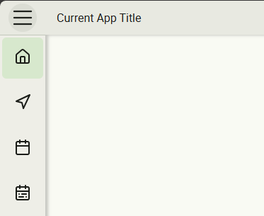

# FsNavFrame Documentation

The `FsNavFrame` provides a flexible, modern navigation frame for Angular Material applications. It includes a responsive sidebar, toolbar, and user profile area, supporting content projection and theming.

> **Angular 20+**: This component uses standalone architecture, signals-based reactivity, and OnPush change detection for optimal performance.

---

## Features

- **Responsive sidebar navigation** with customizable items and icons
- **Toolbar** with start, center, and end content slots
- **User profile section** with name, subname, actions, and profile picture
- **Configurable sizing** for toolbar and sidebar
- **Content projection** for full layout flexibility
- **Material 3 theming** support
- **Signal-based reactivity** for efficient change detection
- **Accessibility** - Full ARIA support with keyboard navigation

---

## Installation

### Standalone Components (Angular 20+)

Import individual components directly:

```typescript
import {
  FsNavFrameComponent,
  FsNavFrameSidebar,
  FsNavFrameSidebarItemComponent,
  FsNavUserProfileComponent,
  FsNavUserProfileActionsDirective,
  FsNavFrameToolbarComponent,
  FsNavFrameToolbarStartDirective,
  FsNavFrameToolbarCenterDirective,
  FsNavFrameToolbarEndDirective,
  FsNavFrameContentDirective,
  NavFrameConfig,
  NavFrameSizing,
  NavRoutes
} from '@fullstack-devops/ngx-mat-components';

@Component({
  selector: 'app-root',
  imports: [
    FsNavFrameComponent,
    FsNavFrameSidebar,
    FsNavFrameSidebarItemComponent,
    FsNavUserProfileComponent,
    FsNavUserProfileActionsDirective,
    FsNavFrameToolbarComponent,
    FsNavFrameToolbarStartDirective,
    FsNavFrameToolbarCenterDirective,
    FsNavFrameToolbarEndDirective,
    FsNavFrameContentDirective,
  ]
})
export class AppComponent {}
```

---

## Main Components & Directives

- [`FsNavFrameComponent`](../projects/ngx-mat-components/src/fs-nav-frame/fs-nav-frame.component.ts) - Main navigation frame
- [`FsNavFrameToolbarComponent`](../projects/ngx-mat-components/src/fs-nav-frame/nav-frame-toolbar/fs-nav-frame-toolbar.component.ts) - Top toolbar
- [`FsNavFrameSidebar`](../projects/ngx-mat-components/src/fs-nav-frame/components/fs-nav-frame-sidebar.ts) - Sidebar container
- [`FsNavFrameSidebarItemComponent`](../projects/ngx-mat-components/src/fs-nav-frame/components/fs-nav-frame-sidebar-item/fs-nav-frame-sidebar-item.component.ts) - Sidebar navigation items
- [`FsNavUserProfileComponent`](../projects/ngx-mat-components/src/fs-nav-frame/fs-nav-user-profile/fs-nav-user-profile.component.ts) - User profile section
- [`FsNavFrameContentDirective`](../projects/ngx-mat-components/src/fs-nav-frame/directives/fs-nav-frame-content.directive.ts) - Main content area

### Toolbar Slot Directives
- [`FsNavFrameToolbarStartDirective`](../projects/ngx-mat-components/src/fs-nav-frame/nav-frame-toolbar/directives/fs-nav-frame-toolbar-start.directive.ts) - Left side content
- [`FsNavFrameToolbarCenterDirective`](../projects/ngx-mat-components/src/fs-nav-frame/nav-frame-toolbar/directives/fs-nav-frame-toolbar-center.directive.ts) - Center content
- [`FsNavFrameToolbarEndDirective`](../projects/ngx-mat-components/src/fs-nav-frame/nav-frame-toolbar/directives/fs-nav-frame-toolbar-end.directive.ts) - Right side content

### User Profile Slot Directives
- [`FsNavUserProfileNameDirective`](../projects/ngx-mat-components/src/fs-nav-frame/fs-nav-user-profile/directives/fs-nav-user-profile-name.directive.ts) - Profile name
- [`FsNavUserProfileSubNameDirective`](../projects/ngx-mat-components/src/fs-nav-frame/fs-nav-user-profile/directives/fs-nav-user-profile-subname.directive.ts) - Profile subname
- [`FsNavUserProfileActionsDirective`](../projects/ngx-mat-components/src/fs-nav-frame/fs-nav-user-profile/directives/fs-nav-user-profile-actions.directive.ts) - Profile action buttons

---

## Basic Usage

```typescript
import { Component, signal } from '@angular/core';
import { RouterOutlet } from '@angular/router';
import {
  FsNavFrameComponent,
  FsNavFrameSidebar,
  FsNavFrameSidebarItemComponent,
  FsNavUserProfileComponent,
  FsNavFrameToolbarComponent,
  FsNavFrameToolbarStartDirective,
  FsNavFrameContentDirective,
  NavFrameConfig,
  NavFrameSizing
} from '@fullstack-devops/ngx-mat-components';
import { HouseIcon, SettingsIcon } from 'lucide-angular';

@Component({
  selector: 'app-root',
  imports: [
    RouterOutlet,
    FsNavFrameComponent,
    FsNavFrameSidebar,
    FsNavFrameSidebarItemComponent,
    FsNavUserProfileComponent,
    FsNavFrameToolbarComponent,
    FsNavFrameToolbarStartDirective,
    FsNavFrameContentDirective,
  ],
  template: `
    <fs-nav-frame [navFrameConfig]="navFrameConfig" [sizing]="sizing">
      <fs-nav-frame-toolbar>
        <fs-nav-frame-toolbar-start>My App</fs-nav-frame-toolbar-start>
      </fs-nav-frame-toolbar>

      <fs-nav-frame-sidebar>
        <fs-nav-frame-sidebar-item 
          routerLink="/home" 
          label="Home">
          <i-lucide [img]="HouseIcon"></i-lucide>
          <span>Home</span>
        </fs-nav-frame-sidebar-item>
        <fs-nav-frame-sidebar-item 
          routerLink="/settings" 
          label="Settings">
          <i-lucide [img]="SettingsIcon"></i-lucide>
          <span>Settings</span>
        </fs-nav-frame-sidebar-item>
      </fs-nav-frame-sidebar>

      <fs-nav-user-profile>
        @if (currentUser(); as user) {
          <ng-container fs-nav-user-profile-name>{{ user.name }}</ng-container>
        }
        <fs-nav-user-profile-actions>
          <button mat-icon-button aria-label="Logout">
            <mat-icon>logout</mat-icon>
          </button>
        </fs-nav-user-profile-actions>
      </fs-nav-user-profile>

      <fs-nav-frame-content>
        <router-outlet />
      </fs-nav-frame-content>
    </fs-nav-frame>
  `
})
export class AppComponent {
  readonly HouseIcon = HouseIcon;
  readonly SettingsIcon = SettingsIcon;
  
  navFrameConfig: NavFrameConfig = {
    appName: 'My Application',
    appVersion: '1.0.0',
    logoSrc: '/assets/logo.png' // Optional
  };

  sizing: NavFrameSizing = {
    toolbarHeight: 3,        // rem units
    sidebarWidthClosed: 4,   // rem units
    sidebarWidthOpened: 18   // rem units
  };

  // Signal-based user state
  currentUser = signal({ 
    name: 'John Doe', 
    email: 'john@example.com' 
  });
}
```

---

## Configuration

### `navFrameConfig` ([`NavFrameConfig`](../projects/ngx-mat-components/src/fs-nav-frame/fs-nav-frame.modules.ts))

```typescript
export interface NavFrameConfig {
  appName?: string;     // Displayed app name (opened mode)
  appVersion?: string;  // Optional app version
  logoSrc?: string;     // Optional logo URL
  sizing?: NavFrameSizing; // Optional sizing config
}
```

### `sizing` ([`NavFrameSizing`](../projects/ngx-mat-components/src/fs-nav-frame/fs-nav-frame.modules.ts))

```typescript
export interface NavFrameSizing {
  toolbarHeight?: number;       // Toolbar height in rem (default: 3)
  sidebarWidthClosed?: number;  // Sidebar width (closed) in rem (default: 4)
  sidebarWidthOpened?: number;  // Sidebar width (opened) in rem (default: 18)
}
```

---

## Sidebar Navigation

### Basic Sidebar Items

```typescript
<fs-nav-frame-sidebar>
  <fs-nav-frame-sidebar-item 
    routerLink="/dashboard" 
    label="Dashboard">
    <i-lucide [img]="LayoutDashboardIcon"></i-lucide>
    <span>Dashboard</span>
  </fs-nav-frame-sidebar-item>
  
  <fs-nav-frame-sidebar-item 
    routerLink="/users" 
    label="Users">
    <i-lucide [img]="UsersIcon"></i-lucide>
    <span>Users</span>
  </fs-nav-frame-sidebar-item>
</fs-nav-frame-sidebar>
```

### Signal-Based Dynamic Navigation

```typescript
@Component({
  template: `
    <fs-nav-frame-sidebar>
      @for (route of routes(); track route.title) {
        <fs-nav-frame-sidebar-item 
          [routerLink]="route.path" 
          [label]="route.title">
          <i-lucide [img]="route.icon"></i-lucide>
          <span>{{ route.title }}</span>
        </fs-nav-frame-sidebar-item>
      }
    </fs-nav-frame-sidebar>
  `
})
export class AppComponent {
  routes = signal<NavRoutes[]>([
    { path: '/home', title: 'Home', icon: HouseIcon },
    { path: '/settings', title: 'Settings', icon: SettingsIcon }
  ]);
}
```

### Accessibility

The sidebar items automatically provide:
- **ARIA labels** via the `label` input (required for screen readers)
- **Keyboard navigation** with Tab/Enter
- **Router link active states** for current page indication

```typescript
// Good: Accessible sidebar item
<fs-nav-frame-sidebar-item 
  routerLink="/home" 
  label="Home page">  <!-- Screen reader reads this -->
  <i-lucide [img]="HouseIcon" aria-hidden="true"></i-lucide>
  <span>Home</span>
</fs-nav-frame-sidebar-item>
```

---

## Toolbar

### Toolbar Layout Slots

```typescript
<fs-nav-frame-toolbar>
  <fs-nav-frame-toolbar-start>
    <!-- Left side: Logo, title -->
    
    <span>My App</span>
  </fs-nav-frame-toolbar-start>
  
  <fs-nav-frame-toolbar-center>
    <!-- Center: Search bar, main actions -->
    <input type="search" placeholder="Search..." />
  </fs-nav-frame-toolbar-center>
  
  <fs-nav-frame-toolbar-end>
    <!-- Right side: Theme switcher, notifications, user menu -->
    <fs-theme-menu />
    <button mat-icon-button aria-label="Notifications">
      <mat-icon>notifications</mat-icon>
    </button>
  </fs-nav-frame-toolbar-end>
</fs-nav-frame-toolbar>
```

### Signal-Based Toolbar State

```typescript
@Component({
  template: `
    <fs-nav-frame-toolbar>
      <fs-nav-frame-toolbar-start>
        {{ appTitle() }}
      </fs-nav-frame-toolbar-start>
      
      <fs-nav-frame-toolbar-end>
        @if (hasNotifications()) {
          <button mat-icon-button 
                  (click)="showNotifications()" 
                  aria-label="Show notifications">
            <mat-icon [matBadge]="notificationCount()" 
                      matBadgeColor="warn">
              notifications
            </mat-icon>
          </button>
        }
      </fs-nav-frame-toolbar-end>
    </fs-nav-frame-toolbar>
  `
})
export class AppComponent {
  appTitle = signal('My Application');
  notificationCount = signal(3);
  hasNotifications = computed(() => this.notificationCount() > 0);
  
  showNotifications() {
    // Handle notification display
  }
}
```

---

## User Profile

### Basic User Profile

```typescript
<fs-nav-user-profile [profilePicture]="userAvatar()">
  <fs-nav-user-profile-name>
    {{ currentUser().name }}
  </fs-nav-user-profile-name>
  
  <fs-nav-user-profile-subname>
    {{ currentUser().role }}
  </fs-nav-user-profile-subname>
  
  <fs-nav-user-profile-actions>
    <button mat-icon-button 
            (click)="logout()" 
            aria-label="Logout">
      <mat-icon>logout</mat-icon>
    </button>
  </fs-nav-user-profile-actions>
</fs-nav-user-profile>
```

### Signal-Based User Management

```typescript
@Component({
  template: `
    <fs-nav-user-profile [profilePicture]="profilePicture()">
      @if (user(); as currentUser) {
        <fs-nav-user-profile-name>
          {{ currentUser.displayName }}
        </fs-nav-user-profile-name>
        
        <fs-nav-user-profile-subname>
          {{ currentUser.email }}
        </fs-nav-user-profile-subname>
        
        <fs-nav-user-profile-actions>
          <button mat-icon-button 
                  [matMenuTriggerFor]="userMenu"
                  aria-label="User menu">
            <mat-icon>more_vert</mat-icon>
          </button>
        </fs-nav-user-profile-actions>
      }
    </fs-nav-user-profile>
    
    <mat-menu #userMenu="matMenu">
      <button mat-menu-item (click)="editProfile()">
        <mat-icon>edit</mat-icon>
        <span>Edit Profile</span>
      </button>
      <button mat-menu-item (click)="logout()">
        <mat-icon>logout</mat-icon>
        <span>Logout</span>
      </button>
    </mat-menu>
  `
})
export class AppComponent {
  user = signal<User | null>({
    displayName: 'Jane Doe',
    email: 'jane@example.com',
    avatarUrl: '/assets/avatar.jpg'
  });
  
  profilePicture = computed(() => this.user()?.avatarUrl ?? '');
  
  editProfile() {
    // Navigate to profile edit
  }
  
  logout() {
    this.user.set(null);
    // Handle logout
  }
}
```

---

## Theming & Styling

The nav frame supports Material 3 theming out of the box.

### SCSS Mixin

Use the provided theme mixin in your styles:

```scss
@use '@fullstack-devops/ngx-mat-components' as fsc;
@use '@angular/material' as mat;

@include mat.app-background();
@include fsc.core();
```

### Custom CSS Variables

Override default sizing with CSS custom properties:

```css
:root {
  --fs-nav-frame-toolbar-height: 4rem;
  --fs-nav-frame-sidebar-width-closed: 3.5rem;
  --fs-nav-frame-sidebar-width-opened: 16rem;
}
```

---

## Advanced Usage

### Programmatic Sidebar Control

```typescript
import { FsNavFrameService } from '@fullstack-devops/ngx-mat-components';

@Component({
  template: `
    <fs-nav-frame>
      <fs-nav-frame-toolbar>
        <fs-nav-frame-toolbar-start>
          <button mat-icon-button 
                  (click)="toggleSidebar()" 
                  aria-label="Toggle sidebar">
            <mat-icon>menu</mat-icon>
          </button>
        </fs-nav-frame-toolbar-start>
      </fs-nav-frame-toolbar>
      
      <!-- Rest of nav frame -->
    </fs-nav-frame>
  `
})
export class AppComponent {
  private navFrameService = inject(FsNavFrameService);
  
  toggleSidebar() {
    this.navFrameService.toggleOpened();
  }
}
```

### Responsive Behavior

The sidebar automatically:
- Closes on mobile devices (< 768px)
- Opens on desktop devices (>= 768px)
- Adjusts based on `NavFrameSizing` configuration

---

## API Reference

### Components
- [`FsNavFrameComponent`](../projects/ngx-mat-components/src/fs-nav-frame/fs-nav-frame.component.ts)
- [`FsNavFrameToolbarComponent`](../projects/ngx-mat-components/src/fs-nav-frame/nav-frame-toolbar/fs-nav-frame-toolbar.component.ts)
- [`FsNavUserProfileComponent`](../projects/ngx-mat-components/src/fs-nav-frame/fs-nav-user-profile/fs-nav-user-profile.component.ts)
- [`FsNavFrameSidebarItemComponent`](../projects/ngx-mat-components/src/fs-nav-frame/components/fs-nav-frame-sidebar-item/fs-nav-frame-sidebar-item.component.ts)

### Interfaces
- [`NavFrameConfig`](../projects/ngx-mat-components/src/fs-nav-frame/fs-nav-frame.modules.ts)
- [`NavFrameSizing`](../projects/ngx-mat-components/src/fs-nav-frame/fs-nav-frame.modules.ts)
- [`NavRoutes`](../projects/ngx-mat-components/src/fs-nav-frame/fs-nav-frame.modules.ts)

### Services
- [`FsNavFrameService`](../projects/ngx-mat-components/src/fs-nav-frame/services/fs-nav-frame.service.ts)

---

## Example Screenshot



---

## See Also

- [Live Demo](https://fullstack-devops.github.io/ngx-mat-components)
- Workspace Example:
  - [app.html](https://github.com/fullstack-devops/ngx-mat-components/blob/main/projects/lib-workspace/src/app/app.html)
  - [app.ts](https://github.com/fullstack-devops/ngx-mat-components/blob/main/projects/lib-workspace/src/app/app.ts)
- [CHANGELOG.md](../CHANGELOG.md) - Migration guide from NgModules
