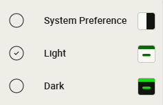

# FsThemeMenu Documentation

The `FsThemeMenu` component provides a user-friendly theme switcher for Angular Material applications, allowing users to toggle between light, dark, and system (auto) color schemes.

---

## Features

- **Switch between Light, Dark, and System themes**
- **Material 3 theming** support
- **Accessible menu** with clear icons and labels
- **Easy integration** into toolbars or navigation frames
- **Persistent theme selection** using `localStorage` (see `localStorageKey` input)

---

## Module Import

```ts
import { FsThemeMenu } from '@fullstack-devops/ngx-mat-components';
```

---

## Main Component

- [`FsThemeMenu`](../projects/ngx-mat-components/src/fs-theme-menu/fs-theme-menu.ts)

---

## Usage Example

```html
<fs-theme-menu [localStorageKey]="'my-theme-key'">
  <i-lucide [img]="PaintBucketIcon"></i-lucide>
</fs-theme-menu>
```

You can place `<fs-theme-menu>` inside your toolbar or anywhere in your layout. The component will display a button that opens a menu for selecting the color scheme.

---

## Inputs & Outputs

- `@Input() theme: FsThemeColorSchemes`  
  Set the current theme (`'auto'`, `'light-mode'`, `'dark-mode'`).

- `@Input() localStorageKey: string`  
  (Optional) The key used for storing the selected theme in `localStorage`. Defaults to `'fs-selected-theme'`. Use this if you want to scope the theme preference to a specific part of your app or avoid conflicts with other components.

- `@Output() themeChange: EventEmitter<FsThemeColorSchemes>`  
  Emits when the user selects a new theme.

---

## Theme Enum

[`FsThemeColorSchemes`](../projects/ngx-mat-components/src/fs-theme-menu/fs-theme-menu.ts):

```ts
export enum FsThemeColorSchemes {
  Auto = 'auto',
  Light = 'light-mode',
  Dark = 'dark-mode',
}
```

---

## How It Works

- The selected theme is applied as a class (`light-mode`, `dark-mode`) to the `<body>`.
- When `'auto'` is selected, the theme follows the user's system preference.
- The menu uses Material Design and includes icons for each theme option.
- Works only with Angular Material 3.
- The selected theme is persisted in `localStorage` under the key specified by `localStorageKey` (default: `'fs-selected-theme'`). Only explicit selections of `'light-mode'` or `'dark-mode'` are stored; selecting `'auto'` removes the key and follows the system preference.
- On initialization, the component reads the value from `localStorage` (if present) and applies it.
- Prepare the `style.scss` file in your project to include the theme styles.

```scss
@use '@angular/material' as mat;
@use '@fullstack-devops/ngx-mat-components' as fsc;
@include fsc.core();

html {
  color-scheme: light dark; // for system preference
  @include mat.theme(
    (
      color: mat.$green-palette,
      typography: Roboto-local,
      density: 0,
    )
  );
}
body.dark-mode {
  color-scheme: dark;
}
body.light-mode {
  color-scheme: light;
}
```

---

## Theming & Styling

- The component supports Material 3 theming.
- SCSS: [`fs-theme-menu.scss`](../projects/ngx-mat-components/src/fs-theme-menu/fs-theme-menu.scss)
- To use the theme in your styles:
  ```scss
  @use '@fullstack-devops/ngx-mat-components' as fsc;
  @include fsc.core();
  ```

---

## API Reference

- [`FsThemeMenu`](../projects/ngx-mat-components/src/fs-theme-menu/fs-theme-menu.ts)
- [`FsThemeColorSchemes`](../projects/ngx-mat-components/src/fs-theme-menu/fs-theme-menu.ts)

---

## Example Screenshot

> **Note:** The colors shown in the theme icon reflect your currently selected theme, providing a visual preview that matches your actual color scheme.



---

## See Also

- [Live Demo](https://fullstack-devops.github.io/ngx-mat-components)
- Workspace Example:
  - [app.html](https://github.com/fullstack-devops/ngx-mat-components/blob/main/projects/lib-workspace/src/app/app.html)
